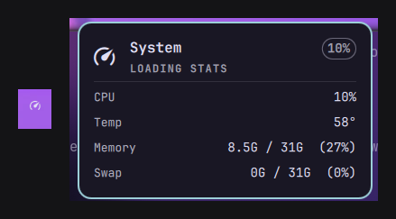

# System Stats

A `bar-widget` plugin for the Omarchy shell that shows a system monitor popup with live CPU, temperature, memory, and swap usage. Click to pin the popup, middle-click to refresh, right-click to launch `btop`.



## Requirements

- Omarchy (Quattro) running on Hyprland
- Python 3 (used by `sys-stats.sh` to read `/proc/stat`, `/proc/meminfo`, and `/sys/class/hwmon`)

## Installation

From the repository root:

```sh
omarchy plugin add https://github.com/SaifOmar/SystemStats.git --enable
```

Then add it to your bar:

```sh
omarchy bar plugin add saif.system-stats
```

The plugin is installed and validated by Omarchy itself; no manual copying required.

## Usage

- **Left-click** — pin / unpin the popup
- **Middle-click** — refresh the stats immediately
- **Right-click** — launch or focus `btop`

## Removal

```sh
omarchy plugin remove saif.system-stats
```

## License

MIT. See [LICENSE](LICENSE).
