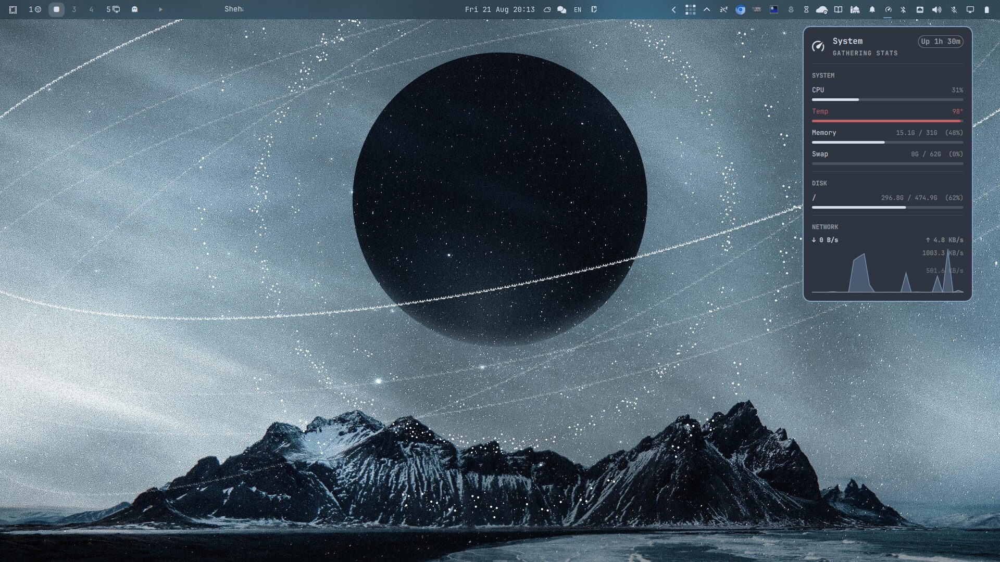

# System Stats

A `bar-widget` plugin for the Omarchy shell that shows a system monitor popup with live CPU, temperature, memory, swap, disk, uptime, and network usage. Usage is shown as horizontal bars; CPU and network throughput as btop-style scrolling graphs with labeled scale gridlines. Click to pin the popup, middle-click to refresh, right-click to launch `btop`.



## Requirements

- Omarchy (Quattro) running on Hyprland
- Python 3 (used by `sys-stats.sh` to read `/proc/stat`, `/proc/meminfo`, `/proc/mounts`, `/proc/net/dev`, and `/sys/class/hwmon`)

## Installation

From the repository root:

```sh
omarchy plugin add https://github.com/SaifOmar/SystemStats.git --enable
```

Then add it to your bar:

```sh
omarchy bar plugin add saif.system-stats
```

The plugin is installed and validated by Omarchy itself; no manual copying required.

## Usage

- **Left-click** — pin / unpin the popup
- **Middle-click** — refresh the stats immediately
- **Right-click** — launch or focus `btop`

## Settings

Per-widget overrides live in your bar layout entry in `~/.config/omarchy/shell.json`:

```json
{
  "id": "saif.system-stats",
  "refreshMs": 2000,
  "historySeconds": 60,
  "showDisks": true,
  "showNetwork": true
}
```

| Key | Default | Description |
| --- | --- | --- |
| `refreshMs` | `2000` | Sampling interval (min 500). Also sets the graph time scale. |
| `historySeconds` | `60` | How much history the graphs keep (min 10). Memory use stays flat regardless. |
| `showDisks` | `true` | Show/hide the DISK section. |
| `showNetwork` | `true` | Show/hide the NETWORK section. |

Network speed tracks the interface owning the default route, so VPN tunnels (Tailscale, WARP, ...) are not double-counted.

## Removal

```sh
omarchy plugin remove saif.system-stats
```

## License

MIT. See [LICENSE](LICENSE).
